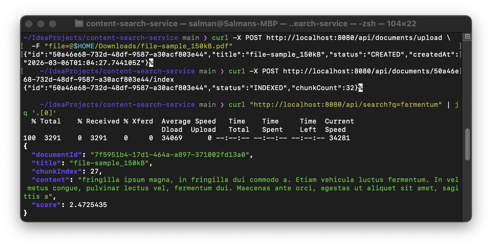

# Content Search Service

A Spring Boot backend service for document ingestion, chunking, indexing, and keyword search over Elasticsearch.

## Why I built this

I built this project to explore backend service design for content indexing and search, with a focus on clean REST APIs, local developer setup, and production-style search workflows.

## Demo note

Verified end-to-end by uploading and indexing a real CV PDF, then retrieving results through keyword search with Elasticsearch.

## Demo



## Stack

- Java 21
- Spring Boot
- Spring Data Elasticsearch
- Elasticsearch
- Docker Compose
- JUnit 5
- MockMvc

## Features

- Create documents through a REST API
- Upload TXT and PDF documents through a multipart API
- Extract text from uploaded PDF documents
- Retrieve documents by ID
- Chunk and index document content into Elasticsearch
- Run keyword search over indexed chunks
- Basic health endpoint
- Automated API tests for core flows

## API Endpoints

### Health
- `GET /api/health/ping`

### Documents
- `POST /api/documents`
- `POST /api/documents/upload`
- `GET /api/documents`
- `GET /api/documents/{id}`
- `POST /api/documents/{id}/index`

### Search
- `GET /api/search?q=...`

## Run locally

### 1. Start Elasticsearch
```bash
docker compose up -d
```

### 2. Run the application
```bash
./mvnw spring-boot:run
```

### 3. Check health
```bash
curl http://localhost:8080/api/health/ping
```

## Example usage

### Create a document
```bash
curl -X POST http://localhost:8080/api/documents \
  -H "Content-Type: application/json" \
  -d '{
    "title": "Index Test",
    "content": "This is a test document that will be indexed and searched."
  }'
```

### Upload a TXT document
```bash
curl -X POST http://localhost:8080/api/documents/upload \
  -F "file=@sample-data/example.txt"
```

### Upload a PDF document
```bash
curl -X POST http://localhost:8080/api/documents/upload \
  -F "file=@$HOME/Downloads/Salman_Manaa_CV_Adobe.pdf"
```

### Get a document by ID
```bash
curl http://localhost:8080/api/documents/<DOCUMENT_ID>
```

### Index a document
```bash
curl -X POST http://localhost:8080/api/documents/<DOCUMENT_ID>/index
```

### Search indexed content
```bash
curl "http://localhost:8080/api/search?q=indexed"
```

## Sample responses

### Create document response
```json
{
  "id": "92e824a7-a85b-43b5-848b-1409417b24a5",
  "title": "Index Test",
  "status": "CREATED",
  "createdAt": "2026-03-06T00:00:53.032132Z"
}
```

### Search response
```json
[
  {
    "documentId": "92e824a7-a85b-43b5-848b-1409417b24a5",
    "title": "Index Test",
    "chunkIndex": 0,
    "content": "This is a longer test document. It should be split into chunks and indexed into Elasticsearch so that later we can search through it.",
    "score": 0.2876821
  }
]
```

## Architecture

```text
Client
  -> Spring Boot REST API
      -> In-memory document store
      -> Chunking service
      -> Elasticsearch indexing
      -> Search endpoint
```

## Testing

Run tests with:

```bash
./mvnw test
```

## Future improvements

- Better PDF extraction quality and formatting preservation
- Support additional file formats
- Semantic search
- Persistent metadata storage
- Search snippets and highlighting
- Better observability and metrics
